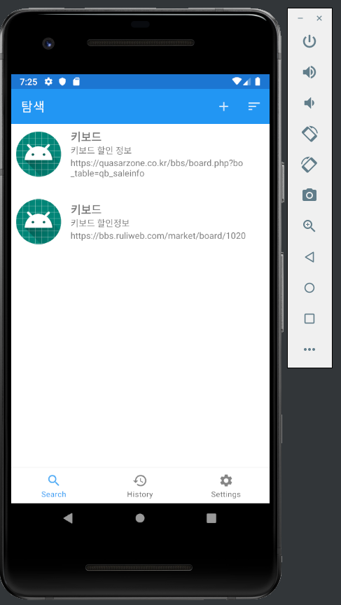
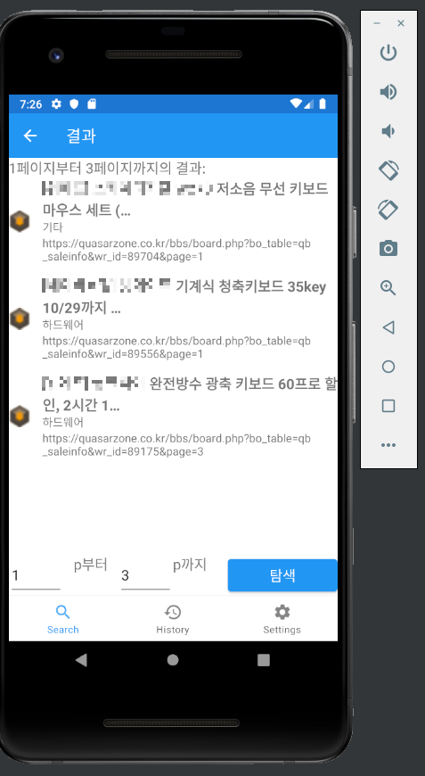

# Probe
**Probe**는 특정 사이트 크롤링을 위한 앱입니다. 기존에 있는 검색 사이트의 목적은 검색어를 포함한 정보를 많이 보여주는 데에 있습니다. 그래서 오히려 유저가 원하는 정보가 명확할 경우 이런 특성이 방해가 됩니다. 예를들어 구글은 검색 도구를 통해 언어, 날짜, 포함여부(모든 결과, 완전일치)를 지정할 수 있지만 대신 정확도가 떨어집니다. 네이버도 검색 옵션을 지원하지만 다른 웹사이트에서 가져오는 글은 마찬가지로 정확도가 떨어지며, 홍보성 글 때문에 오히려 불필요한 정보만 얻게 됩니다.
이처럼 유저가 원하는 정보가 명확한데도 불구하고 다시 검색해보거나 유저가 직접 해당 사이트를 들어가서 보는게 나은 경우가 많습니다. 이러한 사이트가 여러 개가 되면 검색에 낭비되는 시간은 점점 늘어나게 됩니다. 이처럼 특정 정보를 원할 때 소비하는 시간을 줄이고자 한 앱입니다.  

## 실행 화면 (Screenshot)

  
## 컴퓨터 구성 / 필수 조건 안내 (Prerequisites)  
Android Studio  
Java Development Kit  
## 설치 안내 (Installation Process)  
[Android Studio Installation](https://developer.android.com/studio/install)을 참고해주세요.  
## 사용법 (Getting Started)  
앱을 실행하고 오른쪽 상단의 +버튼을 눌러 데이터를 추가하신 후 사용하시면 됩니다.  
## 파일 정보 및 목록 (File Manifest)  
* fragment/  
Fragment 관련 파일입니다. Single Activity 구조를 따르고 있습니다. 
[Navigation Component](https://developer.android.com/guide/navigation)을 이용하여 각각의 Fragment로 이동합니다.  
* site/ 
특정 사이트 관련 파일입니다. 해당 사이트 게시판에 대한 크롤링 기능이 하드코딩 되어 있습니다.  
* data/ 
RecyclerView관련 데이터 클래스와 adapter 파일입니다.    
## 저작권 및 사용권 정보 (Copyright / End User License)  
GNU General Public License v3.0 
자세한 내용은 [LICENSE](https://github.com/Upbo/probe/blob/master/LICENSE)를 참고해주세요.  
## 배포자 및 개발자의 연락처 정보 (Contact Information)  
Hyun Deok Kim - @upbo on GitHub 
khd1326@naver.com  
## 알려진 버그 (Known Issues)  
Data관련 파일들을 json파일에 기록할때 append하지 않고 처음부터 끝까지 새로 기록합니다. 
새로운 사이트를 코드 상으로 추가했을때 기존에 있는 json파일을 삭제해야 json파일에 정상적으로 추가가 됩니다.    
## 문제 발생에 대한 해결책 (Troubleshooting)  
Issue를 작성해주시거나 문제 수정 후 Pull Request를 올려주세요.     
## 크레딧 (Credit)  
### 개발자  
Hyun Deok Kim  
### 라이브러리  
* #### jsoup  
Java HTML Parser  
https://jsoup.org  

* #### glide  
An image loading and caching library for Android focused on smooth scrolling 
https://github.com/bumptech/glide  
 
## 업데이트 정보 (Change Log)  
* ### development build alpha01  
Okky, 퀘이사존, 루리웹의 일부 게시판이 추가되었습니다.    

